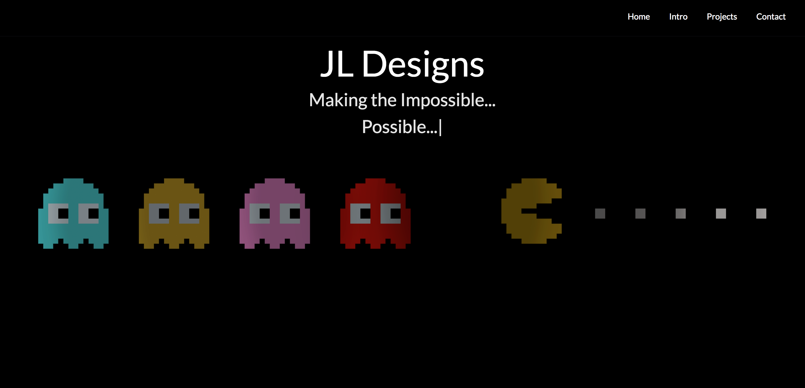
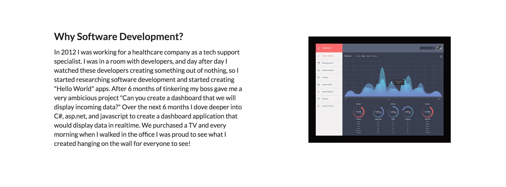
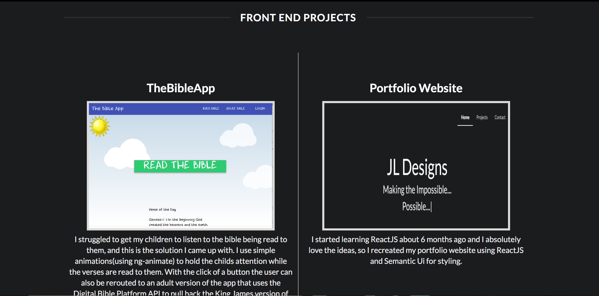
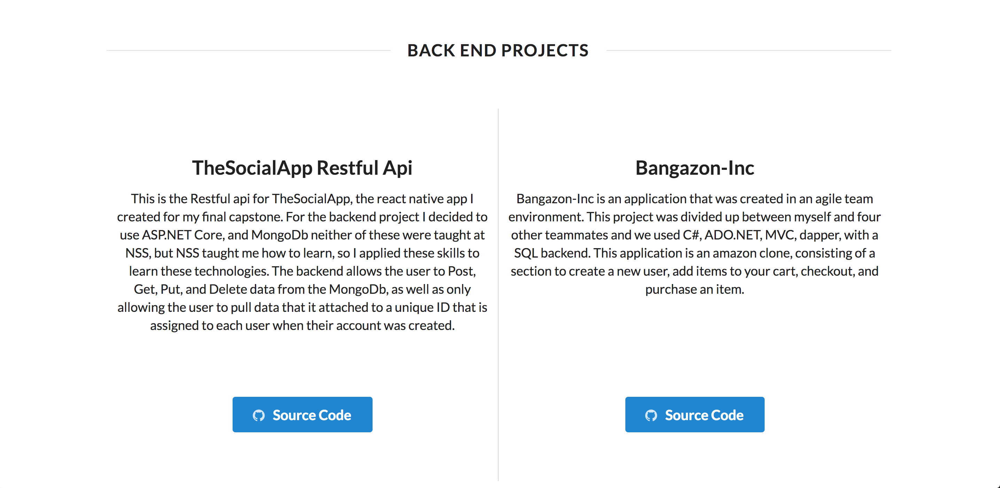
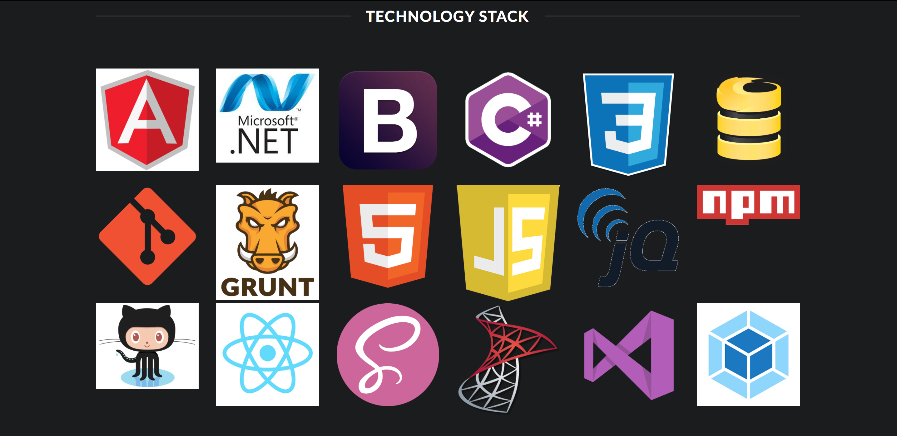

# Portfolio Website

For the last 6 months I have been on a journey to learn React. I have create a mobile application using React-Native, but this is the first full app I have created using React. I recreated my portfolio website using React and Semantic UI for styling. I hope you like what you see.


## Getting Started

To download the project open up a terminal and type
```
git clone git@github.com:justinal64/react-portfolio-website.git
```
This will download the project to your local computer. 

Next cd into the project
```
cd react-portfolio-website
```
Once you are in the proper directory type
```
npm install
```
to install all the project dependencies.
<br />
Next run 
```
npm start
```
in the terminal to run the application locally

## ScreenShots

Home Page

<br />
Intro

<br />
Front End Projects

<br />
Back End Projects

<br />
Tech Stack

<br />


## Built With

* [React](https://facebook.github.io/react/) - Web Framework
* [Semantic UI](https://react.semantic-ui.com) - UI Comonents


## Author

* [Justinal64](https://github.com/justinal64) - Justinal64

## License

This project is licensed under the MIT License - see the [LICENSE.md](LICENSE.md) file for details